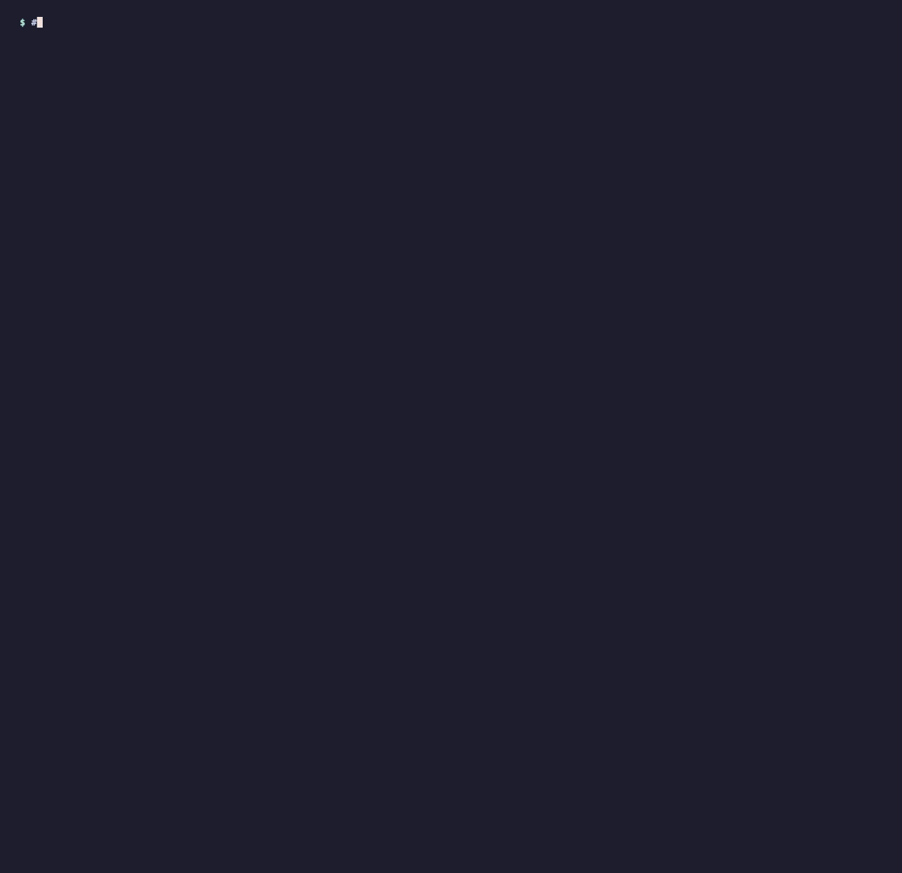

# PROJECT.MD

> **Build the right thing before you build it wrong.** Stop AI coding assistants from walking you into dead-end architectures.

Describe your idea in one sentence. PROJECT.MD checks it against known architectural dead ends, picks a sensible modern stack, and writes the context files your AI coding assistant reads automatically: `CLAUDE.md`, `.cursorrules`, `GEMINI.md`, `AGENTS.md` and `PROJECT.md`.



---

## The problem

A beginner asks an AI assistant: *"Help me write a Python script using OpenCV to transcribe messy doctor handwriting."* The assistant happily writes thousands of lines of contours and thresholding. Two weeks later testing fails completely: OpenCV is an image-filtering toolkit and can't read handwriting. The real answer was a handwriting model like TrOCR.

AI assistants don't push back. PROJECT.MD does, **before line 1**.

## Quick start

No install, no dependencies, just Python 3.9+ on macOS, Linux or Windows.

```bash
git clone https://github.com/SundarReguraman/PROJECT.MD.git
cd PROJECT.MD
python3 -m project_md.cli "An app to transcribe doctor handwriting" --out ../my-app
```

Then open your AI assistant in `../my-app` and start building.

- **Interactive:** run `python3 -m project_md.cli` with no idea and it asks *"What do you want to build?"*.
- **Windows:** use `py` instead of `python3`.
- **Use it from any folder:** run `pip install .` inside the clone once, then `project-md "your idea"` writes files into the current directory.

## What you get

| File | For | Contents |
| :--- | :--- | :--- |
| `PROJECT.md` | Everyone (source of truth) | Verdict and risk score, dead ends (**DO NOT / WHY / USE INSTEAD**), tech stack, architecture layers, data contracts (Pydantic or TypeScript), API endpoints |
| `CLAUDE.md` | Claude Code | Command cheat sheet, stack, **NEVER** list, layer boundaries, code style, open questions |
| `.cursorrules` | Cursor | Flat directives: stack, forbidden approaches, layer rules, typing |
| `GEMINI.md` + `.agent/rules/*.md` | Google Antigravity | Short index plus topic rule files: dead ends, architecture, contracts, security |
| `AGENTS.md` | IBM Bob / OpenCode | Setup commands, forbidden approaches, Plan / Code / Ask mode constraints |

Every file is generated from the same report, so every assistant agrees on the stack and the rules. **Existing files are never overwritten** unless you pass `--force`.

## Verdicts

| Verdict | Meaning | Exit code |
| :--- | :--- | :---: |
| 🟢 **PASS** | No blocking or open issues. If nothing matched at all, it says *"no known traps matched"*: the stack is a sensible default, not a guarantee. | `0` |
| 🟡 **REVIEW** | A person must decide something first, e.g. regulated health/financial data, a copyleft licence, or conflicting requirements. | `0` |
| 🔴 **BLOCK** | The idea explicitly commits to a known dead end ("use OpenCV to read handwriting"). The files are still written, with the replacement mandated. | `3` |

Exit code `1` means an error (e.g. no idea given). Saying you *won't* use something ("I will NOT use OpenCV") never blocks.

## Options

```text
python3 -m project_md.cli [idea ...] [options]

  -o, --out DIR        where to write the files (default: current directory)
  -t, --targets LIST   comma-separated subset: project, claude, cursor, gemini, agents
  -f, --force          overwrite files that already exist
      --no-write       run the pre-flight only; write nothing
      --no-color       plain output (also honours NO_COLOR)
      --version        print the version
```

## How it works

```
idea ─► knowledge-base scan ─► intent inference (platforms, constraints, language)
                                   │
        ┌──────────┬───────────┬───┴──────┬──────────┐        run in parallel
        ▼          ▼           ▼          ▼          ▼        (asyncio.gather)
   dependency  architecture  contract   impact    security
        └──────────┴───────────┴────┬─────┴──────────┘
                                    ▼
                 risk score + PASS / REVIEW / BLOCK verdict
                                    ▼
          PROJECT.md · CLAUDE.md · .cursorrules · GEMINI.md · AGENTS.md
```

| Agent | Decides |
| :--- | :--- |
| **Dependency** | Tech stack, mandated replacements for library traps, licence risks (e.g. Ultralytics YOLO is AGPL) |
| **Architecture** | Domain / Data / Service / Interface layers and forbidden cross-layer imports |
| **Contract** | Data models and API endpoints; money is always integer cents |
| **Impact** | Scope, latency bottlenecks, offline-vs-server conflicts, scaling traps |
| **Security** | Secrets, API keys in client apps, payments, regulated personal data |

The **knowledge base** (`project_md/core/knowledge_base.py`) holds 29 traps across 13 domains: OCR, computer vision, auth, databases, queues, concurrency, real-time, AI/ML, search, scraping, geolocation, payments and notifications. Each explains in plain English *why* the naive approach fails and names the modern replacement.

## Limits

- **Detection is pattern-based, not a language model.** That keeps it instant, offline, dependency-free and testable, but ideas phrased in ways the patterns don't recognise can slip through. When nothing matches, the verdict says so rather than claiming the idea is safe.
- **Data models come from templates** for common app shapes (documents, image analysis, chat, shared editing, shops, service marketplaces, AI assistants). Anything else gets a generic `Item` model to rename.
- **Not yet generated:** `.github/copilot-instructions.md`. See the roadmap in [`docs/PRD.md`](docs/PRD.md).

## Development

```bash
python3 -m unittest discover -s tests -v
```

- **Standard library only.** This is a non-negotiable project rule (see [`CLAUDE.md`](CLAUDE.md)): the tool must run on a fresh machine without `pip install`.
- **Adding a trap:** append a `Trap` to `TRAPS` in `project_md/core/knowledge_base.py`. Give it domain patterns, anti-patterns, a plain-English `why_it_fails` and `recommended` replacements. Then add phrasing tests to `tests/test_knowledge_base.py`. The test suite checks that every trap is owned by exactly one agent.
- **Re-recording the demo:** `brew install vhs`, then `vhs docs/demo/demo.tape`.

```
project_md/
├── cli.py              # entry point: python3 -m project_md.cli
├── core/               # models, knowledge base, intent inference
├── agents/             # 5 specialist agents + orchestrator
├── generators/         # PROJECT.md renderer
└── exporters/          # CLAUDE.md, .cursorrules, GEMINI.md, AGENTS.md
docs/PRD.md             # product requirements and roadmap
tests/                  # unittest suite
```

## License

[MIT](LICENSE)
